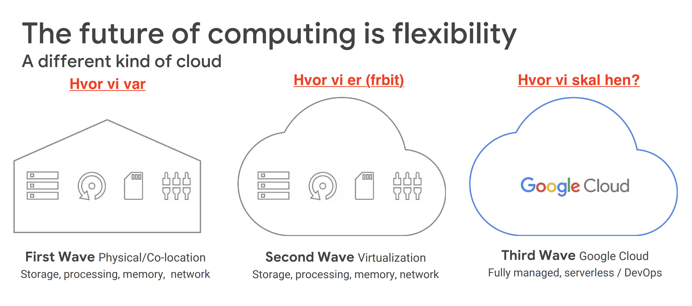

# Notes

> Notes from Google Cloud Platform onBoarding event 
> 22/05 2018

[Q&A Survey](goo.gl/slides/4yg4mv)

## Why GCP

- Best Network infrastruce in the world (40% of all internet traffic!)
- Powerful security: Google is the most targeted platform, so security is high priority
- AI: lots of internal projects/usage
- Open platform:high flexibilty
- Fully managed, serverless - instead of having to control everything as a dev
  - Devs shouldn't have to manage amount of nodes

### How does GCP fit with us?

### Security

Googles mantra:

> Trust nothing

- Dont think about security as a "fortress" (such as VPNs), but think of it like an onien (layers of security)

- GCP means that Google manages most security aspects

---

## Containers

- Google launches 4 **billion** new containers each week!

Docker vs Kubernetes?

---

## The gCloud architecture

Offers everyting between fully managed to automated/dynamic "applications".

1 is most manual managed infrastructure - 5 most automated/dynamic 

1. Compute Engine: IaaS
  - Google provide CPU, memory, disks - you decide what to do with it.
  - Managed VMs
  - High load? Spin up more VMs
  - Google will automatically recommend optimal VM specs

2. Kubernetes Engine
3. 

---

## GCP Usage (getting started)

- The Web Console has everything (including "terminal")
- Mobile Apps are available too
- Cloud Launcher makes deploying "stacks" much easier (such as LAMP stack or a WordPress stack)

### Managing projects

- Create new project for each environment (dev, staging, prod). This is **best practice**, but will also cost more.

---

## Lookup

- Forseti Security
